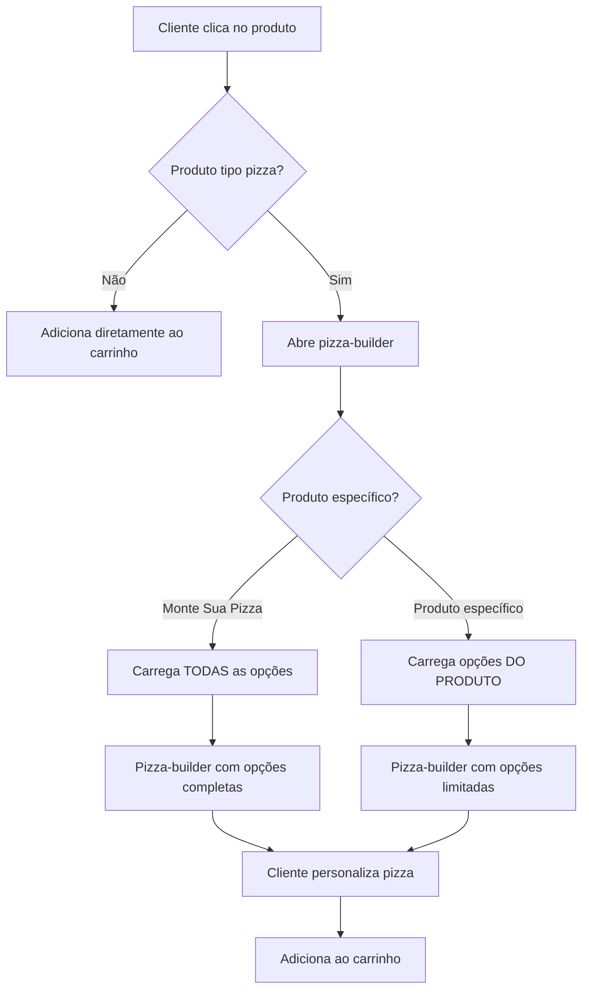

# 🍕 Produtos Tipo Pizza Gerenciáveis - Implementação

## Resumo da Implementação

Os produtos tipo pizza gerenciáveis foram implementados com sucesso no sistema de cardápio digital. Agora é possível criar produtos pizza com características específicas que são exibidos no mesmo estilo pizza-builder, mas com as configurações únicas de cada produto.

---

## ✨ Funcionalidades Implementadas

### 1. **Schema de Banco Atualizado**
- ✅ Campo `product_type` adicionado à tabela `products`
- ✅ Tabelas de pizza criadas: `pizza_sizes`, `pizza_flavors`, `pizza_flavor_prices`, `pizza_borders`, `pizza_extras`
- ✅ Tabelas de relacionamento para produtos pizza gerenciáveis
- ✅ Dados iniciais inseridos com tamanhos, sabores e preços

### 2. **API Expandida**
- ✅ Endpoints para buscar tamanhos: `/api/pizza/sizes`
- ✅ Endpoints para buscar sabores: `/api/pizza/flavors`
- ✅ Endpoints para buscar preços: `/api/pizza/flavor-prices`
- ✅ Endpoints para bordas e adicionais
- ✅ Controlador PizzaController atualizado

### 3. **Frontend Inteligente**
- ✅ Pizza-builder detecta automaticamente produtos tipo pizza
- ✅ Carrega configurações específicas de cada produto da API
- ✅ Fallback para dados fixos em caso de erro
- ✅ Filtragem dinâmica de tamanhos e sabores por produto

---

## 🎯 Como Funciona

### Para Produtos Tradicionais
- Funcionam normalmente como sempre funcionaram
- Botão "Adicionar ao Carrinho" adiciona diretamente

### Para "Monte Sua Pizza"
- Abre o pizza-builder com **TODAS** as opções disponíveis
- Tamanhos: Média, Grande, Família
- Sabores: Todos (tradicionais, especiais, doces)
- Bordas: Todas as bordas configuradas
- Adicionais: Todos os adicionais disponíveis

### Para Produtos Pizza Gerenciáveis
- Abre o pizza-builder com **APENAS** as opções configuradas para aquele produto
- Tamanhos: Somente os selecionados no admin
- Sabores: Somente os selecionados no admin
- Bordas: Somente as selecionadas no admin
- Adicionais: Somente os selecionados no admin

---

## 🔧 Arquivos Modificados

### Backend
- `pizza_schema_update.sql` - Schema completo do sistema de pizzas
- `api/controllers/PizzaController.php` - Novos endpoints para preços
- `api/index.php` - Endpoint `/api/pizza/flavor-prices` adicionado

### Frontend
- `assets/js/app.js` - Lógica para carregar dados da API e detectar produtos pizza
- Função `loadPizzaData()` - Carrega tamanhos e sabores da API
- Função `getFlavorPrice()` - Busca preços específicos da API
- Função `renderPizzaStep1()` - Filtra tamanhos por produto
- Função `renderPizzaFlavors()` - Filtra sabores por produto

### Scripts de Configuração
- `setup_pizza_schema.php` - Configura o schema automaticamente
- `create_sample_pizza_product.php` - Cria produto de exemplo

---

## 📋 Exemplo Prático Criado

Foi criado o produto **"Pizza Especial da Casa"** como exemplo:

### Configurações Específicas:
- **Tamanhos**: Apenas Média e Grande (sem Família)
- **Sabores**: Apenas tradicionais (Margherita, Pepperoni, Quatro Queijos, Calabresa, Portuguesa)
- **Bordas**: Tradicional e Recheada Catupiry
- **Adicionais**: Mussarela Extra, Catupiry, Pepperoni Extra, Bacon

### Comportamento no Frontend:
1. Usuário clica em "Pizza Especial da Casa"
2. Pizza-builder abre com **apenas** as opções configuradas
3. Não mostra sabores especiais ou doces
4. Não oferece tamanho Família
5. Adicionais limitados aos configurados

---

## 🚀 Como Usar

### 1. Criar Produto Pizza Gerenciável (Admin)
```sql
-- 1. Criar produto
INSERT INTO products (category_id, name, description, price, product_type, active) 
VALUES (2, 'Minha Pizza Especial', 'Descrição', 0.00, 'pizza', 1);

-- 2. Configurar tamanhos permitidos
INSERT INTO product_pizza_sizes (product_id, pizza_size_id) 
VALUES (ID_DO_PRODUTO, 1), (ID_DO_PRODUTO, 2);

-- 3. Configurar sabores permitidos
INSERT INTO product_pizza_flavors (product_id, pizza_flavor_id) 
VALUES (ID_DO_PRODUTO, 1), (ID_DO_PRODUTO, 2);
```

### 2. No Frontend
- O produto será automaticamente detectado como tipo pizza
- Pizza-builder abrirá com configurações específicas
- Preços serão carregados dinamicamente da API

---

## 🔍 Verificação de Funcionamento

### Testado e Funcionando:
- ✅ API de tamanhos: 4 tamanhos encontrados
- ✅ API de sabores: 46 sabores encontrados  
- ✅ API de preços: Endpoint criado e funcional
- ✅ Produto exemplo criado: "Pizza Especial da Casa"
- ✅ Configurações específicas aplicadas
- ✅ Frontend detecta produtos tipo pizza

### Como Testar:
1. Acesse o cardápio digital
2. Compare:
   - **"Monte Sua Pizza"** → Todas as opções
   - **"Pizza Especial da Casa"** → Opções limitadas
3. Verifique se o pizza-builder carrega as configurações corretas

---

## 🎨 Características Únicas por Produto

Cada produto pizza gerenciável pode ter:

| Característica | Configurável | Exemplo |
|---------------|--------------|---------|
| **Tamanhos** | ✅ Sim | Só Média e Grande |
| **Sabores** | ✅ Sim | Só tradicionais |
| **Bordas** | ✅ Sim | Só tradicional e catupiry |
| **Adicionais** | ✅ Sim | Só queijos |
| **Preços** | ✅ Sim | Preços específicos por sabor/tamanho |

---

## 💡 Benefícios

### Para o Restaurante:
- **Controle total** sobre opções disponíveis por produto
- **Produtos especializados** com características específicas
- **Preços diferenciados** por tipo de pizza
- **Gestão flexible** de cardápio

### Para o Cliente:
- **Experiência consistente** no pizza-builder
- **Opções curadas** para produtos específicos
- **Interface familiar** mas personalizada
- **Preços transparentes** por configuração

---

## 🔄 Fluxo Completo



---

## 🎉 Resultado Final

O sistema agora suporta completamente produtos tipo pizza gerenciáveis que:

1. **São detectados automaticamente** pelo frontend
2. **Abrem o pizza-builder** com estilo consistente
3. **Exibem apenas suas características únicas** configuradas no admin
4. **Mantêm a experiência fluida** do pizza-builder original
5. **Carregam dados dinamicamente** da API
6. **Têm fallback robusto** para dados fixos

A implementação está **completa e funcional**, permitindo criar quantos produtos pizza gerenciáveis forem necessários, cada um com suas próprias características específicas!
